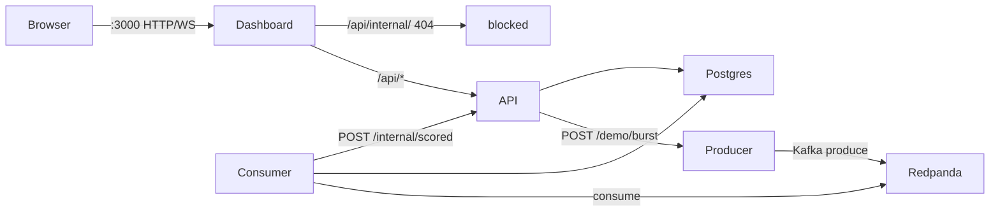
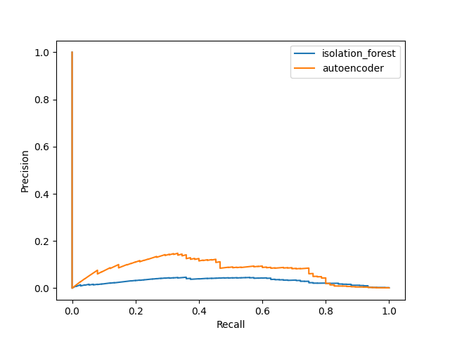

# Fraud Radar

Real-time fraud scoring: Isolation Forest on a Redpanda stream, Postgres, and a 1280px live workspace.

## Run

```bash
docker compose up --build
```

Open http://localhost:3000. The live feed should move within 10 seconds with no click. The dashboard button calls `POST /demo/burst` (never the producer): **50** holdout fraud rows over **2 seconds**, then a **30-second** cooldown. API is on http://localhost:8000.


## Architecture



Six Compose services: `redpanda`, `postgres`, `producer` (port 8001 internal only), `consumer`, `api` (`:8000`), `dashboard` (`:3000`). Nginx does not proxy `/api/internal/`. Isolation Forest is the stream scorer. `scoring_ms` is stored for stats and omitted from WebSocket JSON.

## Models

Isolation Forest is the stream scorer and the default on `POST /score`. Optional `?model=autoencoder` remains 501 in Docker: the image has weights but not torch.

Click a **REVIEW** or **BLOCK** feed or alert row for Isolation Forest permutation-importance bars (top 5 features). ALLOW rows are not clickable. Autoencoder explain is 501 in Docker.

Holdout evaluation (test split only). Fraud prevalence is ~0.17%, so this table is **PR-AUC / precision / recall / F1 at `model_score >= 0.9`**, not accuracy:

| Model | PR-AUC | Precision@0.9 | Recall@0.9 | F1@0.9 |
|---|---|---|---|---|
| Isolation Forest | 0.0297 | 0.0122 | 0.9067 | 0.0240 |
| Autoencoder | 0.0781 | 0.0088 | 0.8533 | 0.0175 |



`model_score` is a training-set percentile in `[0, 1]`. `decide()` composes that score with the amount rule.

Retrain (needs Kaggle credentials): `python -m ml.download_data && python -m ml.train`

## Dev without Docker

```bash
python3.12 -m venv .venv && source .venv/bin/activate
pip install -e ".[dev,ml]"
uvicorn api.main:app --reload
```

```bash
cd dashboard && npm install && npm run dev
```

## Tests

```bash
pytest -v
cd dashboard && npm test
```

## Future Work

- SHAP or richer instance explain beyond permutation importance
- Torch in the API image so Autoencoder explain is not 501 in Docker
- UI toggle between Isolation Forest and Autoencoder on the live stream
- Hosted live demo (managed Kafka-compatible broker + hobby-tier API) — local Compose is the default on purpose
- Ensembling, sequence models, and SMOTE; none of these were needed to prove the streaming + rules seam
