# Fraud Radar — Real-Time Fraud Detection System
*Project Plan for Portfolio Development*

**Owner:** Femi Meduna
**Inspiration:** Stripe Radar
**Goal:** Demonstrate full-stack + applied ML engineering ability through a system that scores streaming transactions for fraud risk in real time and visualizes the results on a live dashboard.

---

## 1. Portfolio Positioning

*Updated after office-hours review — see [[Fraud Radar - Vertical-Slice Design Doc]] for the full session.*

The differentiator is **not** the model, and — as of this revision — it's also not just "everything around the model." A landscape search during the design review found several near-identical GitHub portfolio repos already running this exact stack (Kafka + FastAPI + Postgres + React + Isolation Forest). The base infra combo is commodity now; it alone won't stand out.

The real differentiator is three things layered on top of that base: a **rules-engine seam** — a concrete starter ruleset *(locked 2026-08-20; inclusive thresholds, REVIEW hole closed)*: `BLOCK` if `model_score >= 0.9` OR (`model_score >= 0.6` AND `amount > $500`); `REVIEW` if `model_score >= 0.4`; else `ALLOW` — composed with the model's risk score into a `decision`, mirroring how real Stripe Radar actually works (ML + policy, not just ML), **live per-flag explainability** (SHAP for Isolation Forest, reconstruction-error breakdown for the Autoencoder, shown when you click a flagged transaction), and an **attack-burst control** (a dashboard button that injects a burst of synthetic fraud into the live stream so a viewer watches detection happen in real time). The narrative you want reviewers to walk away with is still *"this person can take a model out of a notebook and turn it into a system"* — but now with a second layer: *"and this person thought about judgment under uncertainty, not just infrastructure."*

That reframes the effort budget again. Time is better spent on the decision/explainability/burst layer and a convincing real-time demo than on either squeezing out AUPRC or over-polishing infra that's now table stakes.

---

## 2. Recommended Depth of Anomaly Detection

**Recommendation: build both Isolation Forest and a simple Autoencoder, compare them properly, and ship the stronger one (or both, selectable) behind the API. Stop there — do not go further into ensembling, deep sequence models, or extensive hyperparameter search.**

Reasoning:

- **Isolation Forest** is fast to train, requires almost no tuning, and gives you a working end-to-end pipeline on day one. It should be the first model wired into the API so the streaming/dashboard work isn't blocked on modeling decisions.
- **A simple Autoencoder** (3–4 layer feedforward, PyTorch, trained only on non-fraud transactions, flagging high reconstruction error) adds real signal to your story: it shows you understand representation learning and can reason about *why* an unsupervised deep model can outperform a classical one on this kind of data. It's a small amount of extra code for a disproportionate amount of portfolio credibility, since "IF vs. autoencoder, and here's the tradeoff" is a strong interview talking point.
- **Comparing them properly matters more than either model alone.** With ~0.17% fraud prevalence, accuracy is a meaningless metric — use precision/recall, PR-AUC (AUPRC), and a precision-recall curve, and say so explicitly in the README. Recruiters with any ML literacy specifically look for whether a candidate knows *not* to report accuracy on an imbalanced dataset. Getting this right is worth more than model sophistication.
- **What to explicitly avoid, and why:** ensemble stacking, LSTM/Transformer sequence models over transaction history, SMOTE/GAN-based oversampling experiments, or a full Optuna hyperparameter sweep. These are things a fraud research team would explore, but for a portfolio project they're time sunk into marginal model gains that a reviewer will skim past, at the cost of the infrastructure work (Kafka, dashboard, deployment) that's actually what makes this project distinctive. If you want to signal "I know this goes deeper," one paragraph in the README under "Future Work" naming these techniques does the job without needing to implement them.

**Net scope:** 2 models, ~1 comparison notebook, 1 clear winner (or a toggle in the API to serve either) — roughly 3–4 days of the total build, not the bulk of it.

---

## 3. System Architecture

*Updated after office-hours review to add the decision/explainability layer and attack-burst control, then refined by an eng review pass (consumer process model, lazy explainability, bounded burst, batched writes) — see [[Fraud Radar - Vertical-Slice Design Doc]]. Slice 0 contracts locked 2026-08-20 (see §3.1).*

```mermaid
flowchart LR
    subgraph Offline["Offline: Training"]
        A[Kaggle creditcard.csv] --> B[Preprocessing & EDA]
        B --> C[Train Isolation Forest]
        B --> D[Train Autoencoder]
        C --> E[Model Comparison<br/>PR-AUC, Precision/Recall]
        D --> E
        E --> F[(Serialized model:<br/>.joblib / .pt + score CDF)]
    end

    subgraph Online["Online: Real-Time Serving"]
        G[Kafka Producer<br/>replays holdout + bounded burst] -->|topic: transactions| H[(Kafka)]
        H --> I["Kafka Consumer<br/>(own process, not in FastAPI app)"]
        I --> J["Decision Engine<br/>score() + decide(score, amount)"]
        F --> J
        J --> K[(Postgres:<br/>scored_transactions<br/>batched writes)]
        K --> L[FastAPI /stream<br/>WebSocket]
        L --> M[React Dashboard<br/>+ burst button]
        M -->|POST /demo/burst| P[FastAPI demo control]
        P -->|Slice 0 stub / Slice 2+ http://producer:8001/burst| G
        M -->|click flagged tx| N["GET /transactions/{id}/explanation<br/>(SHAP / reconstruction error, computed on-demand)"]
        N --> M
    end

    style F fill:#eee,stroke:#999
    style K fill:#eee,stroke:#999
```



**Flow in words:**

1. A producer script reads holdout transactions and publishes them to a Kafka topic at a configurable rate (demo default **10 tx/sec**, range 5–20) to simulate live traffic. The producer also exposes a **bounded** attack-burst control — **50 holdout-shaped fraud-like transactions over 2 seconds, then a 30-second cooldown** — so the demo stays reliably snappy instead of risking an uncapped flood that lags the pipeline right when it needs to look its best. Burst rows are labeled-fraud holdout samples or amount/V-feature perturbations expected to score high; random noise that lands as ALLOW is not a burst.
2. A consumer, **running as its own process/service** (not embedded in the FastAPI app, since the Kafka client is not async and would block the event loop), subscribes to that topic. It calls `score()` and `decide(score, amount)` (in `scoring.py`) to compose the model's risk score with the ruleset in §1 into a `decision` (ALLOW/REVIEW/BLOCK), then **catches, logs, and skips** any malformed/unexpected message rather than crashing the loop. Scored transactions are written to Postgres in **small batches** (flush every 10 rows or 100ms, whichever first) rather than one row at a time, to keep burst-time writes fast. Explanation is **not** computed here — it's deferred to on-demand (see step 4).
3. FastAPI exposes a WebSocket (or Server-Sent Events) stream that pushes newly scored transactions — including their decision — to connected clients **only after the batch write commits** (not at scoring time), so anything the dashboard shows is already queryable via the explain endpoint below, closing a read-after-write race between the batched writer and the explain endpoint (found during eng review). REST: `POST /score`, `GET /health`, `GET /transactions`, `GET /stats`, `GET /transactions/{id}`, `GET /transactions/{id}/explanation`, and **`POST /demo/burst`** (dashboard never calls the producer directly).
4. The React dashboard subscribes to the WebSocket, renders a live feed of transactions with color-coded risk and decision badges, running charts (fraud rate over time, score distribution), a table of flagged/high-risk transactions, and the attack-burst button. The burst button calls `POST /demo/burst` on FastAPI. Clicking any flagged transaction calls `GET /transactions/{id}/explanation`, which computes `explain()` (SHAP for Isolation Forest, reconstruction-error breakdown for the Autoencoder) **on-demand for that one transaction** — not eagerly for every transaction at ingest, which would pay SHAP's cost on ~100% of traffic including the ~99.8% never clicked. Target **<1s p95** for this endpoint (see §10); the dashboard shows a brief loading state, not a blank panel, while it resolves — if SHAP can't hit the budget live, that's what the SHAP fallback (permutation importance, see design doc remaining Open Question) is for.

This is a fairly standard "hot path / cold path" streaming architecture — recognizable to anyone who's worked on data platforms, which is itself a point in your favor. The decision layer, on-demand explainability, and bounded burst control are what keep it from reading as just another hot-path/cold-path tutorial (see §1).

### 3.1 Slice 0 contracts (locked 2026-08-20)

Do not relitigate these while writing Slice 0. They are the five holes that previously blocked execution.

**1. Burst bounds**

| Param | Value |
|---|---|
| Size | 50 transactions |
| Window | 2 seconds |
| Cooldown | 30 seconds |
| Payload | Holdout-shaped fraud (labeled fraud rows or amount/V-feature perturbations that will score high) |

Slice 0 uses these same numbers in a scripted stub so the button cooldown is real from day one.

**2. `model_score` scale**

`model_score` is a float in `[0, 1]`, **higher = more anomalous**. It is an **empirical percentile** of the model's raw output vs the training distribution (persist the training-score CDF / `QuantileTransformer` next to the model artifact). Then `BLOCK if score >= 0.9` means "more anomalous than 90% of training traffic."

- Isolation Forest: percentile of `-score_samples` (or inverted `decision_function`) against training scores.
- Autoencoder: percentile of reconstruction error against training errors.
- Both models use the same procedure so comparison is fair.

Slice 0: return canned floats already on this scale (`0.12`, `0.55`, `0.93`). Slice 1: implement the mapping.

**3. `decide(score: float, amount: float) -> Literal["ALLOW", "REVIEW", "BLOCK"]`**

Inclusive thresholds. The `$500` gate requires `amount`; `decide(score)` is invalid.

- **BLOCK** if `score >= 0.9` or (`score >= 0.6` and `amount > 500`)
- **REVIEW** if `score >= 0.4`
- **ALLOW** otherwise

Worked examples: score `0.95` any amount → BLOCK; `0.70` / `$600` → BLOCK; `0.70` / `$400` → REVIEW (not ALLOW); `0.50` → REVIEW; `0.39` → ALLOW; `0.40` → REVIEW.

**4. API + Postgres schema**

`POST /score` request:

- `transaction_id` (uuid)
- `occurred_at` (datetime)
- `amount` (float)
- `features` (`Time` + `V1`–`V28`)

Response and Postgres table `scored_transactions`:

- `id` (uuid PK, same as `transaction_id`)
- `occurred_at` (timestamptz)
- `amount` (numeric)
- `model_score` (float, `[0, 1]`)
- `decision` (`ALLOW` \| `REVIEW` \| `BLOCK`)
- `model_name` (`isolation_forest` \| `autoencoder`)
- `features` (jsonb) — stored so `explain()` can run later without Kafka
- `created_at` (timestamptz)

Do **not** persist `explanation`. Compute it on `GET /transactions/{id}/explanation`. Slice 0 returns a canned `explanation: list[{feature, contribution}]` on that endpoint (and may include it on the score response for the polling card) so the UI can render without SHAP.

**5. Burst trigger path**

The dashboard talks **only** to FastAPI. FastAPI owns the demo control plane.

- `POST /demo/burst` → `{accepted, size, window_ms, cooldown_seconds}`
- Cooldown active → `accepted: false`, HTTP **429**
- Producer unreachable (Slice 2+) → HTTP **503**
- Slice 0: the route injects 50 canned high-risk scores into the in-memory loop (no producer process)
- Slice 2+: the same route forwards to `http://producer:8001/burst` on the compose network
- Cooldown state has one owner (FastAPI). The button disables from `cooldown_seconds`, not from a guessed client timer.

Tests for these contracts: [[Fraud Radar - Test Plan]].

---

## 4. Tech Stack

| Layer | Choice | Why |
|---|---|---|
| Modeling | scikit-learn (Isolation Forest), PyTorch (Autoencoder) | PyTorch is the more resume-relevant framework right now for full-stack + ML roles; sklearn's IF needs no extra dependency |
| API | FastAPI | Async support for WebSocket + REST (including `POST /demo/burst`); auto-generated OpenAPI docs — free "professionalism" signal. The Kafka consumer is **not** in this process (see Streaming). |
| Streaming | Kafka (or Redpanda as a lighter, Kafka-API-compatible drop-in for easier local dev) | Matches your stated requirement; Redpanda is worth mentioning as a config swap if local Docker resource usage becomes annoying. **`consumer.py` runs as its own docker-compose process/service, not embedded in the FastAPI app** — avoids blocking the async event loop with a non-async Kafka client (confluent-kafka-python has no async API) *(added after eng review)*. Producer exposes internal `POST /burst` on port 8001. |
| Storage | PostgreSQL | Simple, queryable, and a normal production choice — avoids over-engineering with something like Timescale/ClickHouse unless you want a stretch goal |
| Dashboard | React + TypeScript + Recharts + Tailwind, connected via WebSocket | Matches "full-stack developer" positioning better than a Streamlit/Gradio quick UI would. Burst button calls FastAPI `POST /demo/burst` only. |
| Orchestration | Docker Compose | One command (`docker compose up`) to bring up Kafka/Redpanda, Postgres, FastAPI, producer, consumer, and the frontend — this alone is a strong signal of production awareness |
| CI (stretch) | GitHub Actions running lint + tests on push | Cheap to add, disproportionately valued by reviewers skimming a repo |

---

## 5. Repository Structure

```
fraud-radar/
├── README.md                      # Architecture diagram, demo GIF, metrics, how to run
├── docker-compose.yml
├── data/
│   ├── raw/                       # creditcard.csv (gitignored, download script instead)
│   └── processed/
├── notebooks/
│   ├── 01_eda.ipynb
│   ├── 02_isolation_forest.ipynb
│   └── 03_autoencoder.ipynb
├── ml/
│   ├── train_isolation_forest.py
│   ├── train_autoencoder.py
│   ├── evaluate.py                # shared PR-AUC / precision-recall comparison
│   └── artifacts/                 # saved models + score CDF (gitignored, or Git LFS)
├── api/
│   ├── main.py                    # FastAPI: POST /score, POST /demo/burst, /health, /transactions, /stats, GET /transactions/{id}/explanation
│   ├── ws.py                      # WebSocket stream endpoint
│   ├── scoring.py                 # score(transaction), decide(score, amount) -> decision, explain(transaction, model) -> explanation
│   ├── db.py                      # Postgres models (SQLAlchemy) — scored_transactions per §3.1
│   └── tests/
├── streaming/
│   ├── producer.py                # holdout replay at 10 tx/sec default; internal POST /burst (50 tx / 2s / 30s cooldown)
│   └── consumer.py                # separate process (see §4); consumes, scores (lazily — explanation only computed on-demand, not at ingest), persists in batches (flush every 10 rows/100ms; batch flush wrapped in retry-then-log-and-drop, never crashes the loop), catches/logs/skips malformed messages rather than crashing (added after eng review)
├── dashboard/
│   ├── src/
│   │   ├── components/            # LiveFeed, RiskChart, AlertTable, StatsHeader
│   │   └── App.tsx
│   └── package.json
└── .github/workflows/ci.yml       # stretch goal
```

---

## 6. Data Plan

- Source: [Kaggle Credit Card Fraud Detection dataset](https://www.kaggle.com/mlg-ulb/creditcardfraud) — ~284,807 transactions, 492 fraudulent (0.172%), features `V1`–`V28` (PCA-anonymized) plus `Time` and `Amount`.
- Split: train Isolation Forest / Autoencoder on a train split of predominantly legitimate transactions (standard for unsupervised anomaly detection); hold out a test split with the known fraud labels purely for evaluation.
- Score mapping: after training, fit and persist an empirical CDF of raw model outputs on the training set. Online `model_score` is that percentile in `[0, 1]` (see §3.1). Isolation Forest `score_samples` / Autoencoder reconstruction error are never used raw in `decide()`.
- For the streaming demo: reserve a slice of the holdout set (mixed legit + fraud) to replay through Kafka so the dashboard shows a realistic mix, and optionally perturb a few transactions at replay time to simulate "novel" fraud patterns not seen in training — a nice detail to mention in the README as evidence of thinking about model drift.
- **Attack burst payload:** 50 holdout-shaped fraud-like rows (labeled fraud or amount/V-feature perturbations expected to score high), not random noise.
- **The replay stream draws ONLY from the held-out test split, never from training data** *(made explicit after eng review)* — the live demo scores genuinely unseen transactions, not memorized rows. This matters for credibility: it's the same honest-eval discipline as reporting PR-AUC instead of accuracy, and an ML-literate interviewer may ask directly whether the demo is scoring held-out data.

---

## 7. Dashboard / UI Spec

*Design-reviewed — see the Approved design decisions below for the full pass-by-pass rationale.*

**Interactive mockup:** [Fraud Radar dashboard mockup](https://claude.ai/code/artifact/ad8db42d-9170-437c-bb95-bd65b20b1ec2) *(added after gap review of an earlier static mock — implements every view/state below against this spec, dropped everything not in scope)* — also saved locally as `dashboard-mockup.html` in this folder.

**Purpose:** give a reviewer (or you, live in an interview) a 30-second visual "yes, this actually works in real time" moment.

### Design system *(added after design review)*

**Classifier:** App UI (data-dense, task-focused workspace) — not a marketing page. Calm surface hierarchy, few colors, minimal chrome, cardless dense layout (no shadowed-card mosaic).

- **Color (CSS variables, semantic):** `--allow: green-600`, `--review: amber-500`, `--block: red-600` (decision badges); `--bg: near-black neutral` (not pure black); one accent color reserved for interactive elements (the burst button). All colors must meet 4.5:1 contrast on body text.
- **Typography:** monospace for numeric/data fields (amounts, scores, timestamps, throughput) — reinforces the "data instrument" feel; a real sans-serif (not `system-ui`/Tailwind-default Inter) for labels and section headings.
- **Layout:** dense workspace grid, sections divided by whitespace/borders — not individual shadowed cards. Cards only where a card IS the interaction (none currently qualify).

### Information hierarchy *(added after design review)*

**Primary** (always visible, no scroll, on a 13" laptop): the attack-burst control, the live transaction feed, and decision badges — this is the interactive moment and what visibly reacts to it, and it's what a static screenshot/GIF captures too, so the same hierarchy serves both target audiences (90-second GitHub skim and live interview).
**Secondary** (present, lower visual weight): risk-score distribution chart, fraud-rate-over-time chart, alerts table, stats header.

### Core views

- **Live transaction feed** — scrolling/streaming list of incoming transactions as they're scored, each row showing amount, timestamp, risk score (0–1), and a flag badge (Approved / Review / Blocked, mirroring Radar's risk tiers). **Capped at the most recent 50 transactions** *(added after design review)* — older ones drop off the top; full history remains queryable via the Alerts table's existing REST+pagination. Prevents unbounded DOM growth during longer sessions.
- **Risk score distribution chart** — a live-updating histogram or density plot of scores, so a viewer can see the separation between the normal cluster and flagged outliers.
- **Fraud rate over time** — rolling chart of flagged-transaction rate over the last N minutes, useful for showing system behavior under a simulated "attack burst" (a batch of injected fraudulent transactions).
- **Alerts table** — persisted, filterable/sortable table of all transactions above a risk threshold, clickable to see full feature detail — the "case review" screen a fraud analyst would actually use.
- **Stats header** — total transactions processed, current throughput (tx/sec), model latency (p50/p95), flagged count — small but signals you're thinking about the system's operational characteristics, not just the model.
- **Explainability panel** *(added after office-hours review; refined by eng review and design review)* — click any flagged transaction to call `GET /transactions/{id}/explanation`, which computes SHAP (Isolation Forest) or reconstruction-error breakdown (Autoencoder) **on-demand for that one transaction**, not eagerly at ingest. Ships as canned/stubbed values in the earliest build, real by the point the explainability slice lands — see [[Fraud Radar - Vertical-Slice Design Doc]]. **Clicking a new transaction while one is still loading cancels the in-flight request** and shows the new one's loading state — never a stale/wrong explanation.
- **Connection status + auto-reconnect** *(added after eng review)* — the dashboard detects a dropped WebSocket connection, auto-reconnects with backoff, and shows a small "reconnecting..." badge so a network hiccup during a live demo reads as an explained stall, not a silent freeze.
- **Attack-burst control** *(added after office-hours review; refined by eng review; bounds locked 2026-08-20)* — dashboard button calls `POST /demo/burst` on FastAPI (never the producer). Injects **50** synthetic fraud-like transactions over **2 seconds**; button disables for the **30-second** cooldown using `cooldown_seconds` from the response. Keep a pre-recorded GIF on hand as a fallback in case the live trigger misbehaves in front of an interviewer.

Data delivery: WebSocket push from FastAPI for the live feed and rolling charts; on-demand REST call (`GET /transactions/{id}/explanation`) for the explainability panel, only when a transaction is clicked; plain REST + pagination for the historical alerts table; `POST /demo/burst` for the attack-burst control.

### Interaction states *(added after design review)*

| Feature | Loading | Empty | Error | Success | Partial |
|---|---|---|---|---|---|
| Live feed | — | "Waiting for transactions…" with a subtle pulse row, not a blank panel | Connection-status badge covers this (see below) | Row appears with color-coded decision badge | Capped at 50 — oldest drops silently |
| Explainability panel | Brief loading skeleton (<1s p95 budget) | N/A (only opens on click) | If SHAP fallback (permutation importance) triggers, panel shows the same bar-chart format with no visible "fallback" language — the distinction is internal, not user-facing | Feature-contribution bars render | New click cancels in-flight request, shows new loading state |
| Attack-burst control | Button shows a brief "injecting…" state on click | N/A | HTTP 429 (cooldown) keeps the button disabled; HTTP 503 (producer down, Slice 2+) shows a retryable error — burst **can** fail | Button disables, shows cooldown countdown from `cooldown_seconds` | N/A |
| WebSocket connection | — | N/A | "Reconnecting…" badge, auto-retry with backoff | Badge clears when reconnected | N/A |
| Alerts table | Skeleton rows on initial load | "No flagged transactions yet" with the same waiting context as the live feed | Standard REST error state (retry action) | Rows populate, sortable/filterable | Pagination for older history |

### User journey storyboard (live-interview demo) *(added after design review)*

| Step | User does | User feels | Plan specifies |
|---|---|---|---|
| 1 | Dashboard loads (`docker compose up` already running) | "Is this actually real?" | Waiting state (not blank) confirms it's live, not broken |
| 2 | Clicks the attack-burst button | Anticipation | `POST /demo/burst`; button disables + shows "injecting…" — confirms the click registered |
| 3 | Live feed reacts, decision badges shift color in real time | "Whoa" | 50 tx / 2s burst + batched writes + WebSocket-after-commit keep this snappy, not laggy |
| 4 | Clicks a flagged (red/amber) transaction | Curiosity — "why was this flagged?" | Explainability panel opens with a loading skeleton, then feature-contribution bars |
| 5 | Closing impression | "This person thought about production systems, not just a model in a notebook" | §1's positioning narrative, backed by everything above actually working |

### Accessibility *(added after design review)*

Baseline, not full WCAG audit: the attack-burst button (the one primary interactive element) must be keyboard-operable with a visible focus state; decision-badge and status colors must meet 4.5:1 contrast (verify once hex values are picked against the CSS variables above); use semantic `<table>`/`<button>` elements, not `<div onClick>`.

### Responsive scope *(added after design review)*

**Desktop/laptop only (1280px+).** Explicitly out of scope, not a silent gap: the only real viewing contexts for this dashboard are a recorded demo GIF (captured on desktop) and a live interview screen-share (always desktop/laptop) — mobile layout has no realistic audience for this specific project.

---

## 8. Phased Roadmap

*Replaced after office-hours review — the original horizontal phasing (Modeling → API → Streaming → Dashboard) risked shipping several half-finished features rather than one missing one. Restructured as vertical slices: each phase ships one complete, demoable thread through the whole stack, using mocks that get replaced with real pieces in later slices. Full rationale in [[Fraud Radar - Vertical-Slice Design Doc]].*

| Slice | Ships | Mocked | Real | Est. effort |
|---|---|---|---|---|
| **0. Walking skeleton** | Score API + `decision` + `explanation` schema per §3.1, one dashboard card polling the mocked endpoint, scripted `POST /demo/burst` (50/2s/30s) | Kafka (loop), model (canned percentile scores), SHAP (canned), producer (in-memory stub) | API contract, `decide(score, amount)`, dashboard shell | ~2–3 hrs |
| **1. Real model(s)** | Isolation Forest **and** Autoencoder trained on Kaggle set, training-score CDF persisted, PR-AUC/precision/recall comparison reported honestly | Kafka, SHAP, burst | Both models, `/score` endpoint, percentile `model_score` | ~3–4 hrs |
| **2. Real streaming** | Kafka producer + consumer, persisted to Postgres (`scored_transactions` per §3.1), live WebSocket push to dashboard; `POST /demo/burst` forwards to `http://producer:8001/burst` | SHAP, burst payload still scripted if needed | Streaming pipeline | ~4–5 hrs |
| **3. Real explainability** | Live SHAP values + Autoencoder reconstruction-error breakdown per click | Burst | Model comparison, explainability | ~3–4 hrs |
| **4. Real attack-burst** | Dashboard control triggers a live 50-tx / 2s fraud burst, visibly caught in real time; pre-recorded GIF kept as fallback | — | Everything | ~2–3 hrs |
| **5. Polish & demo** | README, architecture diagram, recorded GIF, `docker compose up` bring-up | — | Full stack | ~2–3 hrs |

Every slice boundary is independently demoable and GIF-recordable — the README/demo story never has to say "coming soon." Slice 0 polls the mocked endpoint for simplicity; Slice 2 switches the live feed to WebSocket push (per §7) and that's the transport used from Slice 2 onward.

**Solo time budget:** roughly 16–22 hours total (sum of the estimates above). **These are feature-building estimates only — they don't include contingency for first-time Docker/Kafka networking friction** (§11 already names this as the single most likely place to lose time) *(clarified after eng review)*. If that friction eats into the budget, that's exactly what makes **Slice 2 the acceptable stopping point** rather than a stretch goal — Slices 0–2 alone already prove the differentiator (rules seam + working end-to-end real streaming) even without hardened explainability/burst.

---

## 9. Deployment & Live-Demo Strategy

Running a full Kafka cluster 24/7 for a portfolio demo is expensive and not necessary to prove the point. Recommended approach, in order of preference:

1. **Docker Compose locally, plus a recorded demo.** Anyone can `git clone` + `docker compose up` and see it running in under 5 minutes; a 60–90 second screen recording (GIF or embedded video) in the README covers viewers who won't run it themselves. This is the default and is genuinely sufficient — most recruiters will watch the GIF, not spin up the stack.
2. **If a live-hosted demo is wanted:** use a managed lightweight Kafka-compatible service with a free tier (e.g., Redpanda Cloud, Upstash Kafka) plus a small always-on host for FastAPI + Postgres + the dashboard (Render/Railway/Fly.io free/hobby tier). Explicitly note in the README *why* you chose a managed broker over self-hosting Kafka for the demo (cost/ops tradeoff) — that explanation is itself a signal of production judgment.
3. **Avoid** trying to self-host a full Kafka + Zookeeper cluster on a free-tier VM for a public demo — it's fragile and the cost/benefit isn't there for a portfolio project.

---

## 10. Evaluation Metrics & Success Criteria

Report honestly, not just favorably:

- Precision, Recall, F1, and PR-AUC for both models on the held-out labeled set (not accuracy — call this out explicitly in the README as a deliberate choice given ~0.17% fraud prevalence).
- A precision-recall curve plot comparing Isolation Forest vs. Autoencoder.
- API latency (p50/p95) for `/score`, and **<1s p95 for `GET /transactions/{id}/explanation`** *(added after eng review)* — this is the endpoint a live interviewer directly triggers, so its latency is demo-visible in a way `/score`'s isn't.
- End-to-end pipeline throughput (transactions/sec sustained through Kafka → consumer → DB → dashboard).

Tests live in [[Fraud Radar - Test Plan]] — not "basic tests." That file is the coverage list for `decide()` boundaries, burst 429/503, explanation 404, consumer skip-on-malformed, and the burst-to-dashboard E2E path.

**"Portfolio ready" checklist:**

- [ ] `docker compose up` brings up the entire stack with no manual steps
- [ ] Dashboard visibly updates in real time when the producer is running
- [ ] README has an architecture diagram, a demo GIF/video, and honest metrics
- [ ] Code has type hints, docstrings, and tests covering [[Fraud Radar - Test Plan]] (API, `decide(score, amount)`, burst control, scoring)
- [ ] A "Future Work" section names the deeper techniques considered and consciously deferred (ensembling, sequence models, SMOTE, live cloud hosting) — shows awareness without scope creep

---

## 11. Risks & Notes

- **Imbalanced data is the main modeling trap.** Don't let evaluation quietly default to accuracy; it will look impressive (99.8%+) and immediately read as a red flag to anyone who knows the dataset.
- **Kafka local dev friction** is the most likely place to lose time. If Docker resource usage or Zookeeper/KRaft setup becomes a distraction, switch to Redpanda (same client API, single binary, much lighter) rather than debugging Kafka infra for its own sake — the portfolio value is in the streaming *pattern*, not in Kafka specifically.
- **Scope discipline on the model** is the second biggest risk — it's tempting to keep tuning the Autoencoder for marginal AUPRC gains. Timebox modeling to Slice 1 and move on; the dashboard and streaming pipeline are what get looked at first.
- **Raw model scores are not probabilities.** Using Isolation Forest `score_samples` or Autoencoder reconstruction error directly in the §1 ruleset would make 0.4 / 0.6 / 0.9 meaningless. The percentile mapping in §3.1 is required, not optional polish.
